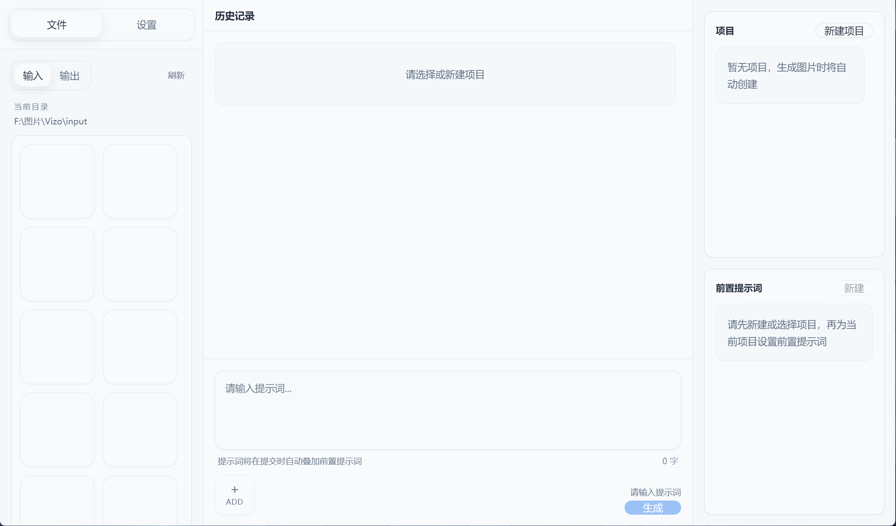

本人是个AI爱好者。@橘子是米努特 抖音、小红书、B站同名。 B站主页：https://space.bilibili.com/471722469?spm_id_from=333.40164.0.0

因为用 banana 生图感觉非常麻烦，需要频繁的新建对话框来规避上下文保留带来的提示词污染感觉非常麻烦。

为了不要每次新建都要重写提示词，重新上传参考，从新设置分辨率和图片比例。

所有有了这个软件的诞生。


# Vizo

Vizo 是一款面向 Windows 的 AI 生图 / 改图桌面工具，适合把日常的提示词创作、参考图管理、项目整理和生成记录放到一个本地应用里完成。

它基于 Electron、React 和 TypeScript 构建，支持接入官方 Gemini 接口，也支持自定义兼容接口地址。你可以把它理解成一个更适合长期使用的本地 AI 出图工作台，而不是一次性网页工具。

<div align="center">
  
  
  <p>这是 Vizo v1.0.0 的主界面预览</p>
</div>

## 适合谁用

- 想在桌面端长期整理 AI 出图项目的人
- 需要频繁切换 API 配置、模型和参数的人
- 想保留提示词、历史记录、输入图和输出图的人
- 希望把图片素材和生成流程管理得更清楚的人

## 主要功能

- AI 生图 / 改图
  - 支持文本提示词
  - 支持上传参考图参与生成
  - 支持输出数量、比例、分辨率等参数设置

- 多配置管理
  - 支持保存多个 API 配置
  - 支持 API Key、接口地址、模型名覆盖
  - 支持连接校验，方便快速确认配置是否可用

- 项目管理
  - 支持创建多个项目
  - 每个项目可独立管理历史记录和提示词预设
  - 适合按主题、客户、角色或场景分类整理

- 前置提示词预设
  - 可为项目保存多条前置提示词
  - 提交生成时可按选择结果自动拼接到主提示词前面
  - 适合固定画风、角色设定、镜头语言等场景

- 历史记录与复用
  - 自动保存生成历史
  - 保留输入图、输出图、提示词、参数和所用配置
  - 便于回看、复用和持续迭代

- 文件库
  - 内置输入 / 输出图片文件库面板
  - 支持拖拽导入、刷新和快速查看
  - 更方便整理参考图与结果图

- 本地目录与代理设置
  - 支持自定义输入目录和输出目录
  - 支持系统代理或手动代理配置
  - 更适合国内网络环境和长期本地归档

## 数据说明

- 软件配置、项目设置、前置提示词和历史记录默认保存在本机用户目录
- 输入图和输出图保存在本地目录中，不会自动上传到 GitHub
- API Key 由用户自行填写并保存在本地

如果你只是下载源码或安装包，本项目本身不会附带作者的个人配置和缓存数据。

## 下载与安装

发布版安装包会放在仓库的 Releases 页面。

- 进入仓库的 `Releases`
- 下载最新的 `Vizo-x.y.z-Setup.exe`
- 双击安装后即可使用

如果你是在 GitHub 上浏览本项目，通常可以从仓库右侧的 `Releases` 区域进入下载页。

## 使用流程

1. 添加 API 配置
2. 选择模型与生成参数
3. 新建或选择一个项目
4. 输入提示词，按需附加前置提示词
5. 上传参考图或直接开始生成
6. 在历史记录和文件库中查看与整理结果

## 技术栈

- Electron
- React
- TypeScript
- Tailwind CSS
- Radix UI / shadcn 风格组件

## 本地开发

环境要求：

- Node.js 18+
- npm

安装依赖：

```bash
npm install
```

如果 Electron 下载较慢，可以先设置镜像再执行安装：

```bash
set ELECTRON_MIRROR=https://npmmirror.com/mirrors/electron/
npm install
```

启动开发环境：

```bash
npm run dev
```

## 打包

构建 Windows 安装包：

```bash
npm run build:win
```

构建产物默认输出到 `release/` 目录。
[docs/RELEASING.md](docs/RELEASING.md)

## 说明

- 当前主要面向 Windows 桌面使用
- 首次安装时若出现“未知发布者”提示，属于未签名安装包的常见现象
- 如需正式商用分发，建议进一步接入代码签名
